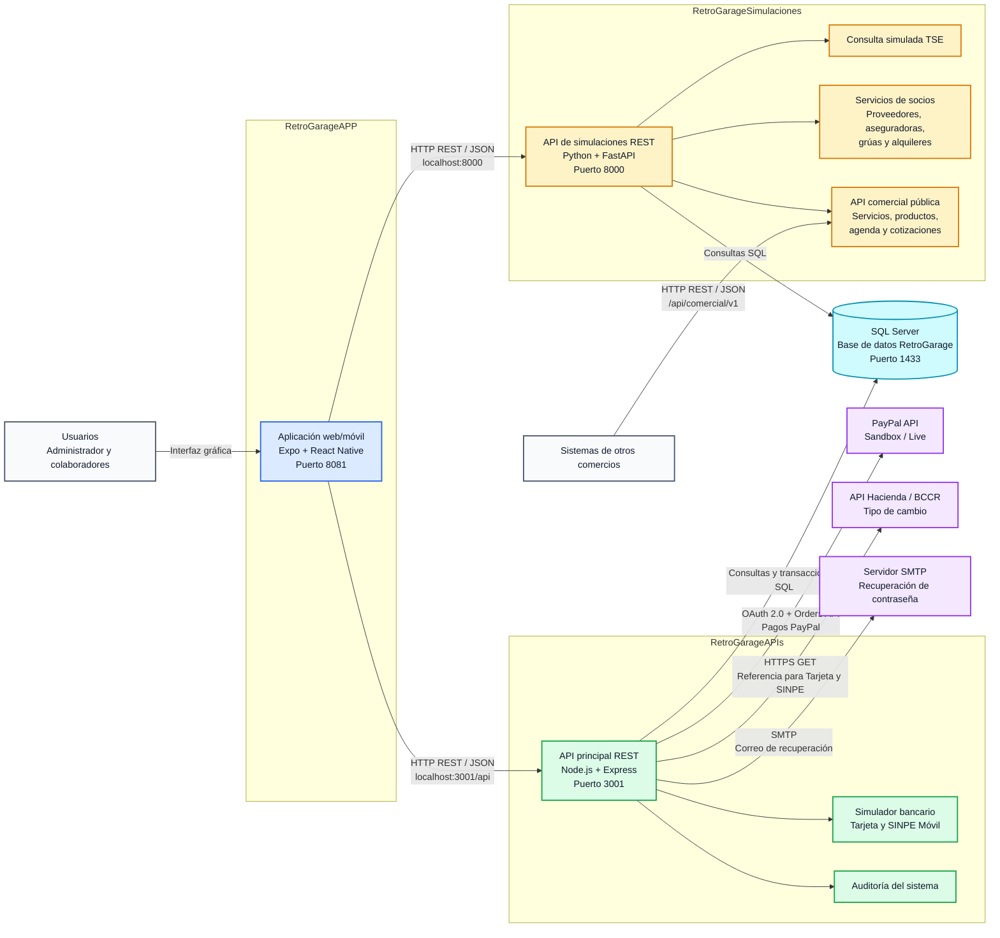

# Diagrama de arquitectura de RetroGarage

Este diagrama representa los tres proyectos, la base de datos compartida y
los servicios externos utilizados por el sistema.

## Lectura del diagrama

- `RetroGarageAPP` es el frontend que utiliza el usuario.
- El frontend se comunica mediante HTTP y JSON con la API principal en el
  puerto `3001`.
- Para las consultas simuladas de TSE y socios, el frontend también consume
  directamente la API FastAPI del puerto `8000`.
- Las dos APIs consultan la misma base de datos SQL Server `RetroGarage`.
- La API principal contiene el simulador bancario de Tarjeta y SINPE.
- La API principal se comunica externamente con PayPal, Hacienda/BCCR y el
  servidor de correo.
- La API comercial de FastAPI permite que otro comercio consulte información
  pública de RetroGarage.
